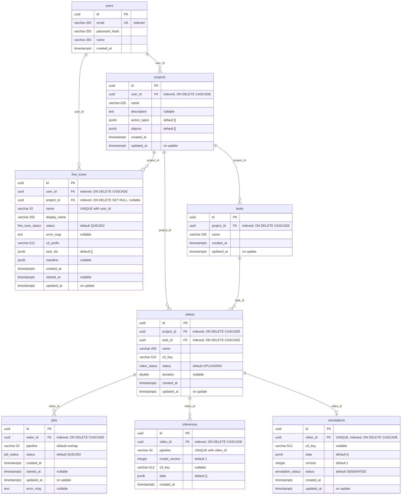

# Database Schema

PostgreSQL 16. The database stores metadata and state only — video files and annotation
artifacts live in S3 (see [storage.md](storage.md)).

Source of truth: [`backend/app/models.py`](../backend/app/models.py) and the migrations in
`backend/alembic/versions/`. This document describes what those files declare; if the two
disagree, the code is right and this document is stale.

---

## Full entity-relationship diagram



All primary keys are `uuid` generated application-side (`uuid.uuid4`), not by the
database. All timestamps are `TIMESTAMP WITH TIME ZONE`, written from Python as UTC
(`datetime.now(timezone.utc)`).

---

## Tables

### `users`

| Column | Type | Constraints | Notes |
|---|---|---|---|
| `id` | `uuid` | PK | Generated in Python |
| `email` | `varchar(255)` | UNIQUE, indexed | Login identifier |
| `password_hash` | `varchar(255)` | NOT NULL | bcrypt (`bcrypt` library directly, not passlib) |
| `name` | `varchar(255)` | NOT NULL | Display name |
| `created_at` | `timestamptz` | NOT NULL | |

Deleting a user cascades to their projects, and from there to everything below.

### `projects`

| Column | Type | Constraints | Notes |
|---|---|---|---|
| `id` | `uuid` | PK | |
| `user_id` | `uuid` | FK → `users.id` ON DELETE CASCADE, indexed | Ownership is the only access rule; there are no roles |
| `name` | `varchar(255)` | NOT NULL | |
| `description` | `text` | nullable | |
| `action_types` | `jsonb` | NOT NULL, default `'[]'` | Action vocabulary for this dataset task |
| `objects` | `jsonb` | NOT NULL, default `'[]'` | Object vocabulary |
| `created_at` | `timestamptz` | NOT NULL | |
| `updated_at` | `timestamptz` | NOT NULL, `onupdate` | |

`action_types` and `objects` are plain JSON arrays of strings, normalised by
`clean_labels()` on write (trimmed, de-duplicated case-insensitively, first spelling
wins). They are passed to the ML pipeline in `JobContext` and drive the dropdowns in the
editor.

Deleting a project also deletes the S3 prefix `projects/{project_id}/`.

### `videos`

| Column | Type | Constraints | Notes |
|---|---|---|---|
| `id` | `uuid` | PK | |
| `project_id` | `uuid` | FK → `projects.id` ON DELETE CASCADE, indexed | |
| `name` | `varchar(255)` | NOT NULL | Original file name; used for export file names |
| `s3_key` | `varchar(512)` | NOT NULL | `projects/{project_id}/videos/{video_id}/original.mp4` |
| `status` | `video_status` | NOT NULL, default `UPLOADING` | |
| `duration` | `double precision` | nullable | Filled in by the ML service from `ffprobe` |
| `created_at` | `timestamptz` | NOT NULL | Also the ordering key for previous/next navigation |
| `updated_at` | `timestamptz` | NOT NULL, `onupdate` | |

There is no unique constraint on `s3_key`, but it is unique in practice because it is
derived from `project_id` and `video_id`.

### `jobs`

| Column | Type | Constraints | Notes |
|---|---|---|---|
| `id` | `uuid` | PK | Also the Redis Stream message payload key |
| `video_id` | `uuid` | FK → `videos.id` ON DELETE CASCADE, indexed | |
| `pipeline` | `varchar(32)` | NOT NULL, default `overlap` | Selects the inference implementation |
| `status` | `job_status` | NOT NULL, default `QUEUED` | |
| `created_at` | `timestamptz` | NOT NULL | Latest-job lookup orders by this |
| `started_at` | `timestamptz` | nullable | Set when the consumer marks `PROCESSING` |
| `updated_at` | `timestamptz` | NOT NULL, `onupdate` | |
| `error_msg` | `text` | nullable | Exception plus traceback from the ML service |

Jobs accumulate: every run creates a new row, so the processing history of a video is
preserved even though the inference result is not (see below).

### `annotations`

The working copy the user edits. **One row per video** — `UNIQUE (video_id)`.

| Column | Type | Constraints | Notes |
|---|---|---|---|
| `id` | `uuid` | PK | |
| `video_id` | `uuid` | FK → `videos.id` ON DELETE CASCADE, UNIQUE, indexed | |
| `s3_key` | `varchar(512)` | nullable | Points at the artifact written by the ML service |
| `data` | `jsonb` | NOT NULL, default `{}` | `{video_id, duration, fps, segments[]}` |
| `version` | `integer` | NOT NULL, default 1 | Incremented on every `PUT /annotation` |
| `status` | `annotation_status` | NOT NULL, default `GENERATED` | Flips to `EDITED` on the first user save |
| `created_at` | `timestamptz` | NOT NULL | |
| `updated_at` | `timestamptz` | NOT NULL, `onupdate` | |

`version` is a counter, not a history: previous states are not stored. It tells you how
many times the annotation was saved, nothing more.

Re-running a pipeline overwrites this row via `upsert_working_annotation()` and resets
the status to `GENERATED` — **including the user's edits**. That is intentional (a re-run
is a request for a fresh draft), but it is worth knowing before pressing the button
twice.

### `inferences`

Raw model output, kept separately from the working annotation. **One row per
`(video_id, pipeline)`** — `UNIQUE (video_id, pipeline)`.

| Column | Type | Constraints | Notes |
|---|---|---|---|
| `id` | `uuid` | PK | |
| `video_id` | `uuid` | FK → `videos.id` ON DELETE CASCADE, indexed | |
| `pipeline` | `varchar(32)` | NOT NULL, unique with `video_id` | `overlap`, `dense`, `sequential`, … |
| `model_version` | `integer` | NOT NULL, default 1 | Reported by the pipeline implementation |
| `s3_key` | `varchar(512)` | nullable | See the caveat in [storage.md](storage.md) |
| `data` | `jsonb` | NOT NULL, default `{}` | Same shape as `annotations.data` |
| `created_at` | `timestamptz` | NOT NULL | |

**What this does and does not give you.** Because the unique key is
`(video_id, pipeline)`, you can run one clip through several *different* pipelines and
compare their outputs side by side — that is the point of the table. What you cannot do
is keep two results from the *same* pipeline: `upsert_inference()` looks the row up by
`(video_id, pipeline)` only and overwrites it, recording the new `model_version` in
place. Bumping a pipeline's version and re-running destroys the previous result.

If comparing versions of one pipeline becomes necessary, the fix is to widen the unique
constraint to `(video_id, pipeline, model_version)` and look rows up by all three.

### `fine_tunes`

Domain Marlin fine-tune jobs. One row per training run; `name` is the pipeline id that
appears in the Model menu after `COMPLETED`.

| Column | Type | Constraints | Notes |
|---|---|---|---|
| `id` | `uuid` | PK | Also the Redis `ml-finetune` message `job_id` |
| `user_id` | `uuid` | FK → `users.id` ON DELETE CASCADE, indexed | ACL owner |
| `project_id` | `uuid` | FK → `projects.id` ON DELETE SET NULL, nullable, indexed | Source project; survives project delete |
| `name` | `varchar(32)` | UNIQUE with `user_id` | e.g. `marlin_ft_a3f21c` |
| `display_name` | `varchar(255)` | NOT NULL | Shown in the picker |
| `status` | `fine_tune_status` | NOT NULL, default `QUEUED` | |
| `error_msg` | `text` | nullable | Traceback on failure |
| `s3_prefix` | `varchar(512)` | NOT NULL | `users/{user_id}/models/{id}/` |
| `task_ids` | `jsonb` | NOT NULL, default `'[]'` | Snapshot of selected task UUIDs |
| `manifest` | `jsonb` | nullable | Filled on complete (videos, sizes, `mocked`) |
| `created_at` | `timestamptz` | NOT NULL | |
| `started_at` | `timestamptz` | nullable | Set when consumer marks `PROCESSING` |
| `updated_at` | `timestamptz` | NOT NULL, `onupdate` | |

GT for training is assembled from `annotations` with non-empty `segments` (any status) —
never from S3 `annotation.json` (raw model output artifact).

---

## Enum types

Created as native PostgreSQL enums.

| Type | Values | Used by |
|---|---|---|
| `video_status` | `UPLOADING`, `UPLOADED`, `QUEUED`, `PROCESSING`, `COMPLETED`, `FAILED` | `videos.status` |
| `job_status` | `QUEUED`, `PROCESSING`, `COMPLETED`, `FAILED` | `jobs.status` |
| `annotation_status` | `GENERATED`, `EDITED` | `annotations.status` |
| `fine_tune_status` | `QUEUED`, `PROCESSING`, `COMPLETED`, `FAILED` | `fine_tunes.status` |

`videos.status` mirrors the state of the latest job plus the two upload states that
precede any job. Adding a value to any of these enums requires a migration
(`ALTER TYPE ... ADD VALUE`), not just an edit to the Python enum.

---

## Indexes and constraints

| Name | Table | Definition | Why |
|---|---|---|---|
| PK | all | `id` | |
| `ix_users_email` | `users` | UNIQUE on `email` | Login lookup |
| `ix_projects_user_id` | `projects` | on `user_id` | Project list per user |
| `ix_videos_project_id` | `videos` | on `project_id` | Video list per project |
| `ix_jobs_video_id` | `jobs` | on `video_id` | Latest-job lookup |
| `ix_annotations_video_id` | `annotations` | on `video_id` | |
| `ix_inferences_video_id` | `inferences` | on `video_id` | |
| `uq_annotations_video_id` | `annotations` | UNIQUE `(video_id)` | One working annotation per video |
| `uq_inferences_video_pipeline` | `inferences` | UNIQUE `(video_id, pipeline)` | One stored result per pipeline |
| `ix_fine_tunes_user_id` | `fine_tunes` | on `user_id` | List / ACL |
| `ix_fine_tunes_project_id` | `fine_tunes` | on `project_id` | Project history |
| `uq_fine_tunes_user_name` | `fine_tunes` | UNIQUE `(user_id, name)` | Pipeline id unique per user |

Every foreign key carries `ON DELETE CASCADE`, so deleting a user removes the entire
subtree. SQLAlchemy relationships also declare `cascade="all, delete-orphan"`, meaning
deletion works whether it goes through the ORM or straight SQL.

---

## Migration history

| Revision | What it does |
|---|---|
| `001_initial` | `users`, `projects`, `videos`, `jobs`, `annotations`; the three enum types |
| `002_project_catalogs` | Adds `projects.action_types` and `projects.objects` (JSONB, default `'[]'`) |
| `003_inferences` | Adds `jobs.pipeline` (default `overlap`); creates `inferences` with its unique constraint and index |
| `004_inference_version` | Adds `inferences.model_version` (default 1) |
| `005_tasks` | Adds `tasks`; `videos.task_id` |
| `006_fine_tunes` | Adds `fine_tune_status` enum and `fine_tunes` table |

Migrations run automatically on backend startup (`alembic upgrade head` in the container
`CMD`). To run them by hand:

```bash
docker compose exec backend alembic upgrade head
```

---

## Querying by hand

Adminer is exposed at `http://localhost:8080` (server `postgres`, user/password/database
from `.env`, `boundr` by default). Or:

```bash
docker compose exec postgres psql -U boundr -d boundr
```

Useful starting points:

```sql
-- pipeline results stored for one video
SELECT pipeline, model_version, jsonb_array_length(data->'segments') AS segments, created_at
FROM inferences WHERE video_id = '...';

-- videos whose annotation a human has actually touched
SELECT v.name, a.version, a.status
FROM videos v JOIN annotations a ON a.video_id = v.id
WHERE a.status = 'EDITED';

-- failed jobs with their error
SELECT id, video_id, pipeline, left(error_msg, 200)
FROM jobs WHERE status = 'FAILED' ORDER BY created_at DESC;
```
