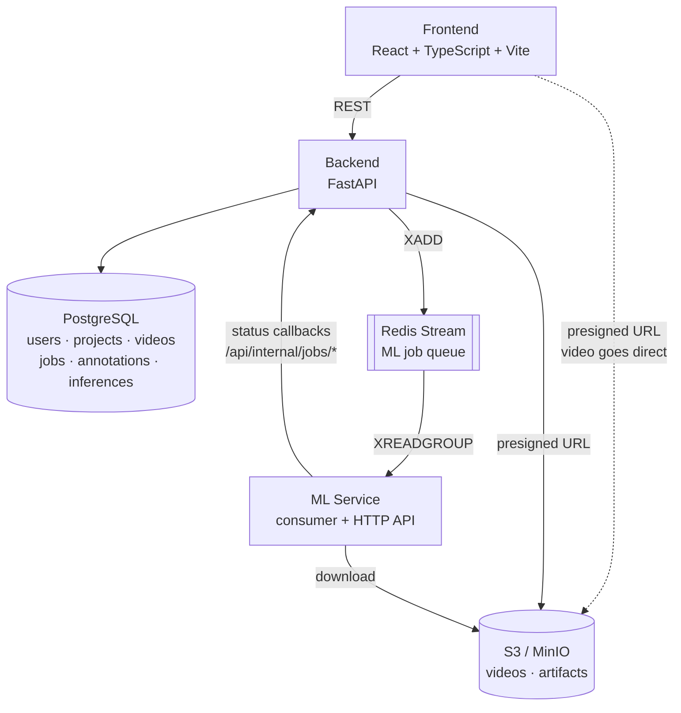
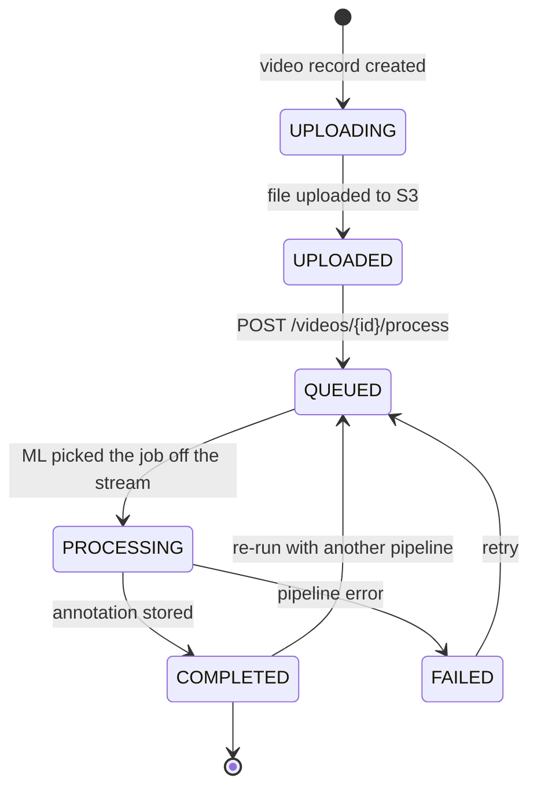
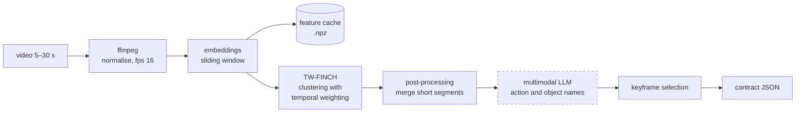
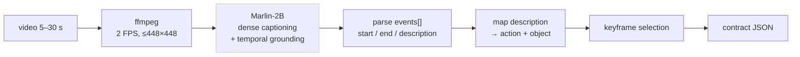
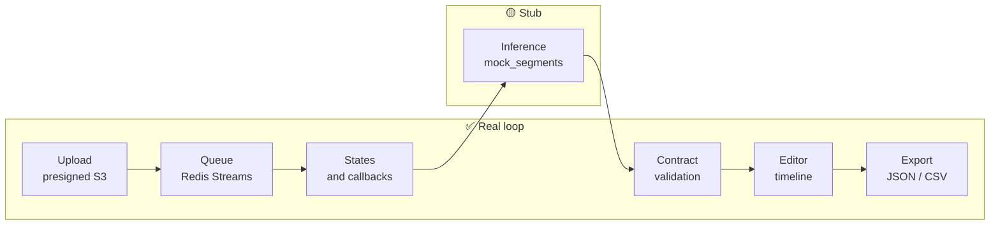
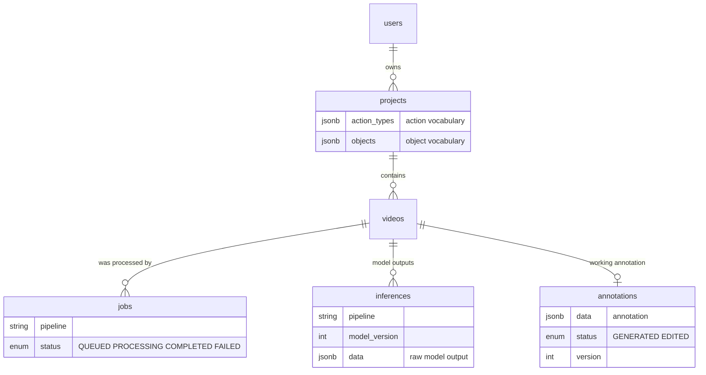

# Diagrams

## 1. Service architecture

What matters here:

- Video **never passes** through the backend or Redis — only through S3 via presigned URLs.
- Redis delivers jobs; the backend is the source of truth for state.
- A consumer group with `XACK`: a job is not lost when the ML service restarts.
- All model specifics stay inside `ml-service`.

A raster version of this diagram: [architecture.png](architecture.png).

---

## 2. Job lifecycle

The annotation carries its own separate status: `GENERATED` (came from the model) →
`EDITED` (the user changed it). This distinguishes human-verified annotation from
unverified — material for dataset quality.

---

## 3. ML pipeline: hybrid configuration

The dashed block is the one blocked by external API access (Gemini geo-blocking, balance
requirements). Everything else is implemented and has been run. For an alternative to that
block with no external APIs, see 3b.

**Division of labour between tracks (in the hybrid):** segmentation supplies accurate
temporal boundaries — it sees transitions in motion and invents nothing. The LLM attaches
names to finished intervals, which segmentation cannot do by construction
(`action="segment"`, `object="cluster_N"`).

---

## 3b. Alternative: one model instead of a pipeline

The open video-VLM Marlin-2B (Apache 2.0) emits events with second-precise timestamps in
a single pass, potentially replacing the whole "embeddings → clustering → LLM labelling"
chain. A trial run has been performed; quality on our task is unmeasured.

The fork is settled by one run against ground truth: if Marlin's boundaries land within
2 s, this scheme wins; if not, the hybrid from §3 stays, with Marlin supplying names only.
Both variants write the same JSON, so the product does not depend on the choice.

---

## 4. What works today and what is a stub

The stub returns segments with a correct structure and the right duration — it reads real
video metadata through `ffprobe` and extracts a frame through `ffmpeg`, so the whole
file-handling path is exercised — but the content is synthetic.

Replacing the stub with a real model means implementing one `infer()` method on the
abstract `Inference` class. Neither the backend nor the frontend changes.

---

## 5. Data model

**The key decision:** `inferences` and `annotations` are separate. Raw model outputs are
stored apart from the working annotation, one row per `(video_id, pipeline)`. That lets
one clip be run through several *different* pipelines and compared without losing the
user's edits.

Note what this does **not** give you: two results from the *same* pipeline cannot
coexist. `upsert_inference()` looks the row up by `(video_id, pipeline)` alone and
overwrites it, recording the new `model_version` in place — so bumping a pipeline's
version and re-running destroys the previous result. Full schema, including the fix if
version-to-version comparison becomes necessary: [database.md](database.md).
