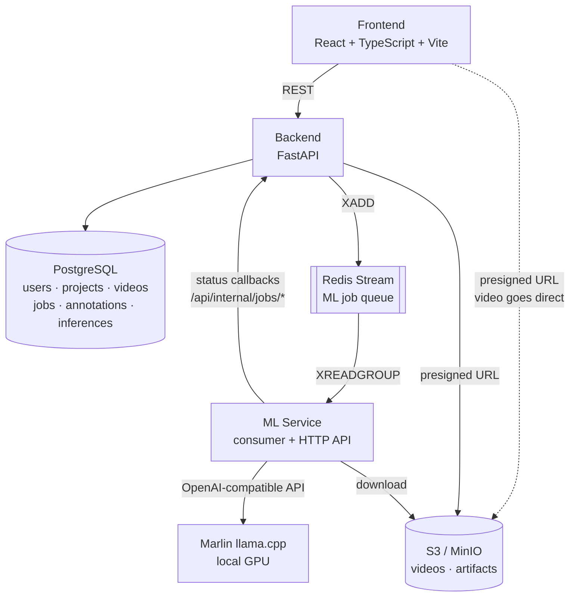
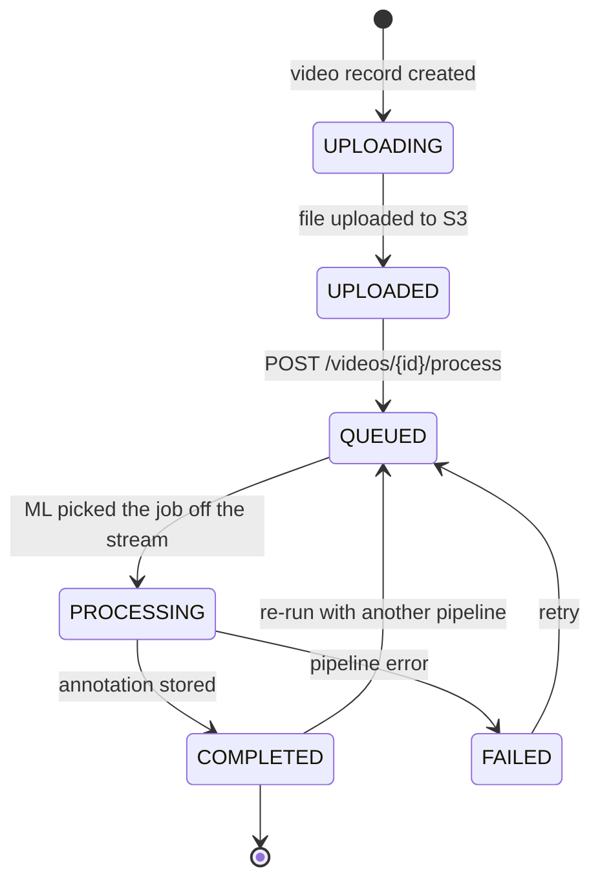
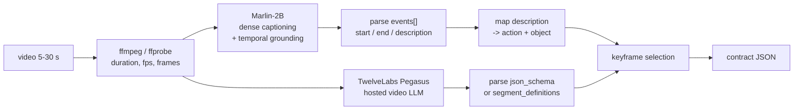
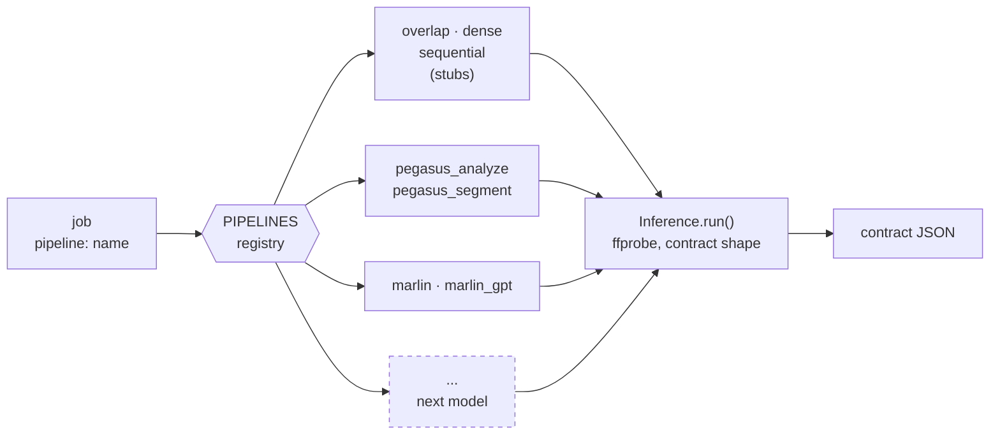
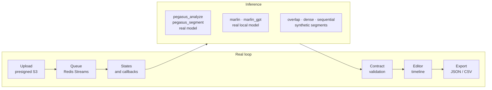
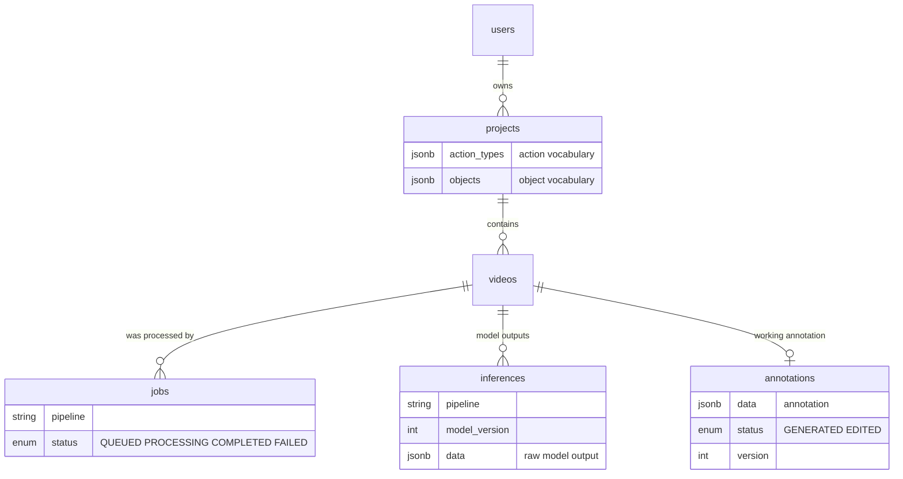

# Diagrams

## 1. Service architecture

What matters here:

- Video **never passes** through the backend or Redis — only through S3 via presigned URLs.
- Redis delivers jobs; the backend is the source of truth for state.
- A consumer group with `XACK`: a job is not lost when the ML service restarts.
- All model specifics stay inside `ml-service`.

A raster version of this diagram: [architecture.png](architecture.png).

---

## 2. Job lifecycle

The annotation carries its own separate status: `GENERATED` (came from the model) →
`EDITED` (the user changed it). This distinguishes human-verified annotation from
unverified — material for dataset quality.

---

## 3. ML pipelines in the MVP

Two pipeline implementations are available for the MVP. Both take a video and emit the
same contract JSON, so the product does not depend on which one a project uses — the
pipeline is chosen by name per job. The default Compose deployment waits for the local
Marlin server because Marlin is selected by default.

**`marlin` / `marlin_gpt` (implemented; `marlin` is default).** The open video-VLM
[`NemoStation/Marlin-2B`](https://huggingface.co/NemoStation/Marlin-2B) (Apache 2.0) runs
locally: no per-clip GPU cost, no geo-blocking. It emits events with second-precise
timestamps in one pass. Sampling is 2 FPS up to a 120-second input limit. `marlin`
parses captions with spaCy; `marlin_gpt` maps the same captions through GPT-4o-mini
on OpenRouter.

**`pegasus_analyze` / `pegasus_segment` (implemented).** A hosted TwelveLabs model, one
package with two modes: `general` with a `json_schema` response and a real `prompt`, and
`time_based_metadata` (SME) which segments the video itself and rejects the `prompt`
parameter — there the whole prompt lives in the segment definition description. In
practice the two trade off against each other: SME segments more finely, `general`
reasons over the whole clip and picks better verbs.

The implementations remain separate because they fail for unrelated reasons: Marlin is
a local GPU service, while Pegasus is a hosted API.

### The extension point

Neither branch is privileged. A pipeline is a package under `ml-service/app/inference/`
implementing one `infer()` method, registered by name:

Model behavior stays behind `Inference`; the backend and frontend expose only its name
and version.

**Dropped: the TW-FINCH hybrid.** Earlier plans routed embeddings through TW-FINCH
clustering with temporal weighting to get boundaries, then attached names with a separate
LLM call. That chain is not part of the MVP. Both surviving pipelines produce boundaries
and labels in one pass, which makes the segmentation-plus-labelling split redundant. The
research behind it is recorded in the project overview, §6.

---

## 4. What works today and what is a stub

The Pegasus pipelines upload video to TwelveLabs and map the reply onto the contract.
Marlin runs locally through llama.cpp. `marlin` parses captions with spaCy;
`marlin_gpt` sends the same captions to GPT-4o-mini via OpenRouter.
The three original pipelines remain as stubs — they return synthetic segments
with a correct structure and the right duration, reading real metadata through `ffprobe`,
so the whole file-handling path stays exercised without spending an API call. They are
useful for testing the loop and are not scheduled for removal.

---

## 5. Data model

**The key decision:** `inferences` and `annotations` are separate. Raw model outputs are
stored apart from the working annotation, one row per `(video_id, pipeline)`. That lets
one clip be run through several *different* pipelines and compared without losing the
user's edits.

Note what this does **not** give you: two results from the *same* pipeline cannot
coexist. `upsert_inference()` looks the row up by `(video_id, pipeline)` alone and
overwrites it, recording the new `model_version` in place — so bumping a pipeline's
version and re-running destroys the previous result. Full schema, including the fix if
version-to-version comparison becomes necessary: [database.md](database.md).
