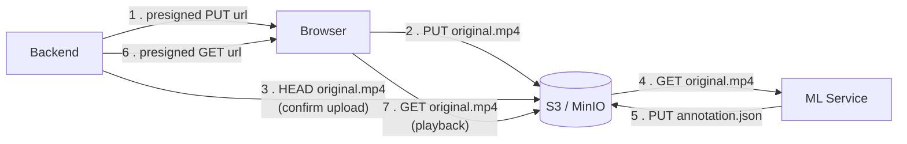

# Object Storage Layout

S3-compatible storage, MinIO in development. Everything that is a file lives here; the
database holds only metadata and pointers (see [database.md](database.md)).

Source of truth: [`backend/app/s3.py`](../backend/app/s3.py) and
[`ml-service/app/s3.py`](../ml-service/app/s3.py).

---

## Key layout

A single bucket (`boundr` by default, `S3_BUCKET` in `.env`):

```text
boundr/                                          ← bucket
├── projects/
│   └── {project_id}/                            ← project UUID
│       └── videos/
│           └── {video_id}/                      ← video UUID
│               ├── original.mp4                 ← uploaded source video
│               └── annotation.json              ← latest pipeline output
└── users/
    └── {user_id}/
        └── models/
            └── {fine_tune_id}/
                ├── manifest.json                ← training set snapshot
                └── checkpoint.json              ← stub (mock); later GGUF
```

Keys are built by helpers and nowhere else:

```python
video_s3_key(project_id, video_id)           # projects/{p}/videos/{v}/original.mp4
annotation_s3_key(project_id, video_id)      # projects/{p}/videos/{v}/annotation.json
fine_tune_s3_prefix(user_id, fine_tune_id)   # users/{u}/models/{ft}/
```

Fine-tune checkpoints live **outside** `projects/{id}/` so deleting a project
(`delete_prefix("projects/{id}/")`) does not wipe trained weights. Ownership is
enforced in the app layer (JWT / user_id), not MinIO IAM.

The ML service does not know about project ids. It derives the annotation key from the
video key it received in the job message by swapping the last path segment
(`annotation_key_from_video_key`). Keeping the video layout hierarchical is what makes that
possible — and what makes deleting a project a single prefix delete.

---

## Who touches what



| Object | Written by | Read by | When |
|---|---|---|---|
| `original.mp4` | Browser, via presigned PUT | ML service (internal endpoint), browser (presigned GET, playback) | Once on upload; on every processing run and every page view |
| `annotation.json` | ML service, via the internal endpoint | Nothing, currently | On every completed job |

**Video bytes never pass through the backend.** The backend only issues presigned URLs
and confirms afterwards that the object exists. This is the reason there is no upload
size limit in the API and no multipart handling in FastAPI.

`annotation.json` is currently write-only in practice: the annotation the UI reads comes
from `annotations.data` in PostgreSQL, not from S3. The object exists as an artifact —
something to hand over, inspect, or re-import — not as a read path.

---

## Two endpoints for one storage

The backend builds two boto3 clients against the same bucket:

| Client | Endpoint | Used for |
|---|---|---|
| `internal_s3()` | `S3_ENDPOINT`, e.g. `http://minio:9000` | Server-side calls: `head_object`, `delete_object`, `delete_prefix`, bucket creation |
| `public_s3()` | `S3_PUBLIC_ENDPOINT`, e.g. `http://localhost:9000` | Generating presigned URLs |

The split matters because a presigned URL is signed *for a specific host*. Signing with
the internal Docker hostname would produce a URL the browser cannot resolve; signing
with the public host and calling it from inside the compose network would fail the other
way. Presigned URLs expire after `S3_PRESIGN_EXPIRES` seconds.

Signature version is `s3v4` with path-style addressing — MinIO does not do virtual-host
addressing without DNS configuration.

---

## CORS

The browser uploads and plays video directly from MinIO, so the bucket needs CORS.

On startup the backend calls `put_bucket_cors` with the origins from `CORS_ORIGINS`,
allowing `GET`, `PUT`, `POST`, `HEAD`, `DELETE` and exposing `ETag`, `Content-Length`,
`Content-Type`. Newer MinIO builds no longer implement `PutBucketCors`; the call is
wrapped in a `try`/`except` and the compose file sets `MINIO_API_CORS_ALLOW_ORIGIN: "*"`
as the fallback. A `minio-init` service additionally applies `infra/minio-cors.json`.

Three layers for one thing, which is more than it should be — but MinIO's CORS behaviour
varies enough between builds that removing any one of them needs testing against the
exact image in use.

---

## Lifecycle and deletion

| Action | Effect on storage |
|---|---|
| Delete a video | `delete_object` on both `original.mp4` and `annotation.json` |
| Delete a project | `delete_prefix("projects/{project_id}/")` — paginated `list_objects_v2` + batched `delete_objects` |
| Delete a user | Cascades in the database; **S3 objects are not touched** |

The first two paths are clean. The third orphans data: deleting a user removes their
projects through the FK cascade, but nothing walks those projects to delete their S3
prefixes. The objects become unreferenced — invisible to the application, still billable
in a real S3.

This does not matter for a hackathon demo. In production the usual fix is a periodic
reconciliation job — list prefixes, compare against `videos.s3_key`, delete the
difference — which is cheaper than making every delete path transactional across two
systems.

---

## Known caveat: `annotation.json` is shared between pipelines

The annotation key contains no pipeline name. Two runs of the same video through
different pipelines write to the **same object**:

```text
overlap   → projects/{p}/videos/{v}/annotation.json
dense     → projects/{p}/videos/{v}/annotation.json   ← overwrites
```

Consequently several rows in `inferences` — one per pipeline, each with its own `data` —
can carry an identical `s3_key` pointing at whichever run finished last. No data is lost:
the real per-pipeline result lives in `inferences.data` in PostgreSQL. But the `s3_key`
column is misleading, and anyone reading the artifact from S3 expecting a specific
pipeline's output will get the wrong file.

The fix, if artifacts need to be per-pipeline, is to include the pipeline in the key:

```text
projects/{p}/videos/{v}/annotations/{pipeline}.json
```

That requires changing `annotation_s3_key`, passing the pipeline name to the ML service's
key derivation (it already receives it in the job message), and a one-off migration of
existing objects.

---

## Naming caveat: `original.mp4` is always `.mp4`

The key is hardcoded with an `.mp4` suffix regardless of what was uploaded. The case
permits MOV as well, so a MOV file is stored under an `.mp4` name.

This breaks nothing — `ffprobe` and `ffmpeg` read the container, not the extension, and
the browser gets the `Content-Type` from the presigned PUT — but it is confusing when
inspecting the bucket by hand, and it would break any tooling that trusts extensions.
Storing the real extension, or dropping the extension entirely, would both be more
honest.

---

## Inspecting the bucket

MinIO console: `http://localhost:9001`, credentials from `.env`
(`minioadmin`/`minioadmin` by default).

With the `mc` client:

```bash
docker compose exec minio-init sh -c \
  'mc alias set local http://minio:9000 $MINIO_ROOT_USER $MINIO_ROOT_PASSWORD && \
   mc ls --recursive local/$S3_BUCKET'
```

---

## Configuration

| Variable | Default | Meaning |
|---|---|---|
| `S3_BUCKET` | `boundr` | Bucket name; created on backend startup if missing |
| `S3_ENDPOINT` | `http://minio:9000` (compose); `http://localhost:9000` (code default) | Internal endpoint for server-side calls |
| `S3_PUBLIC_ENDPOINT` | `http://localhost:9000` | Host used when signing URLs for the browser |
| `S3_ACCESS_KEY` / `S3_SECRET_KEY` | `minioadmin` | Credentials |
| `S3_REGION` | `us-east-1` | Required by the signature, unused by MinIO |
| `S3_PRESIGN_EXPIRES` | `3600` | Lifetime in seconds of presigned upload and playback URLs |

Moving to real S3 means changing these values only — no code changes. The endpoint split
stays meaningful there too (VPC endpoint versus public host).
